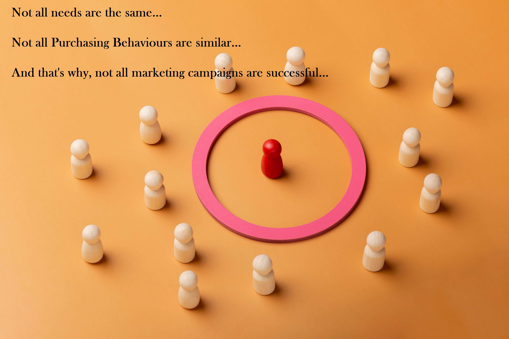
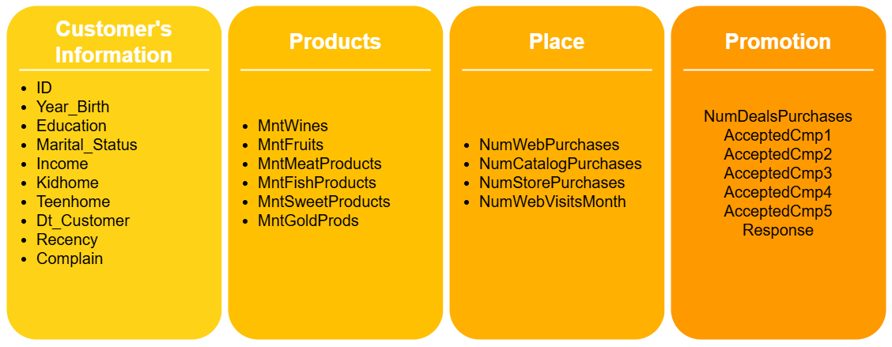
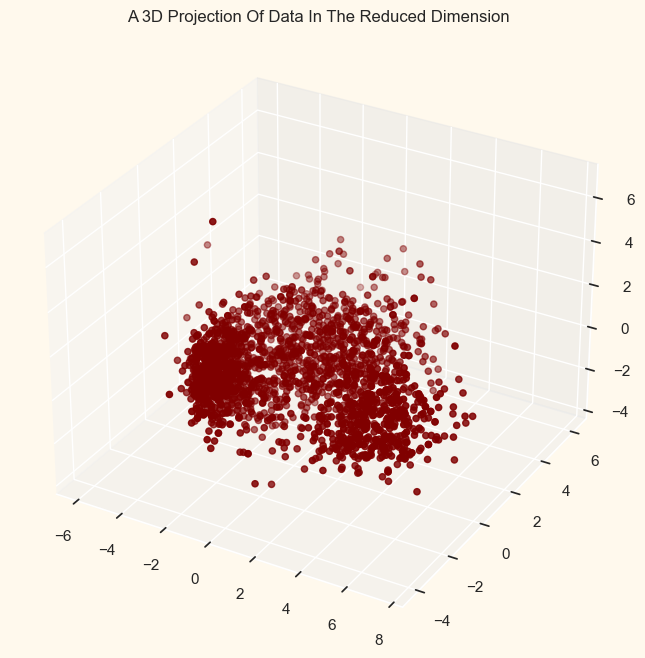
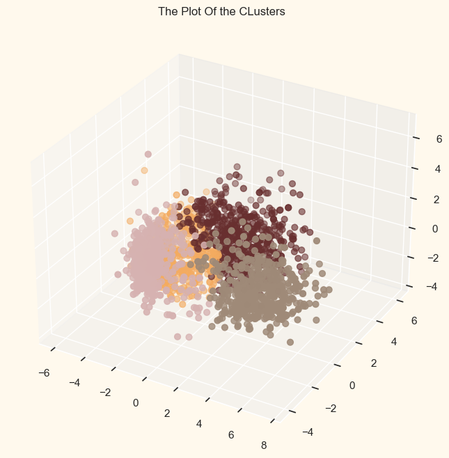
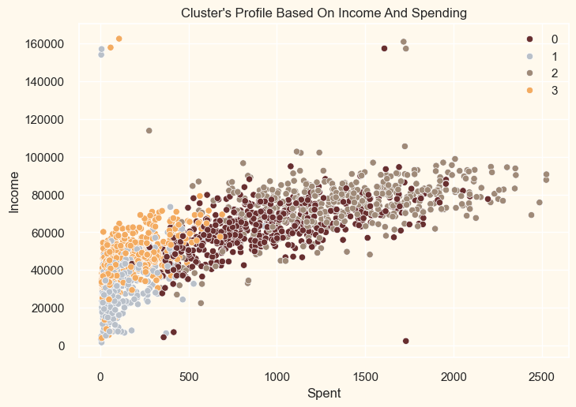
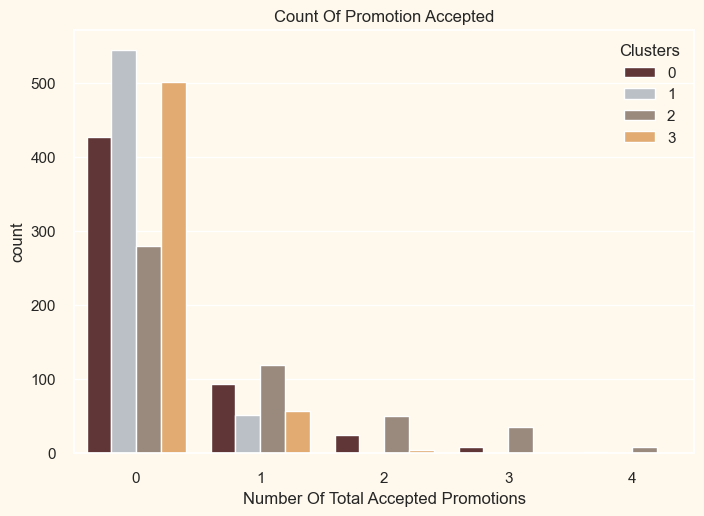
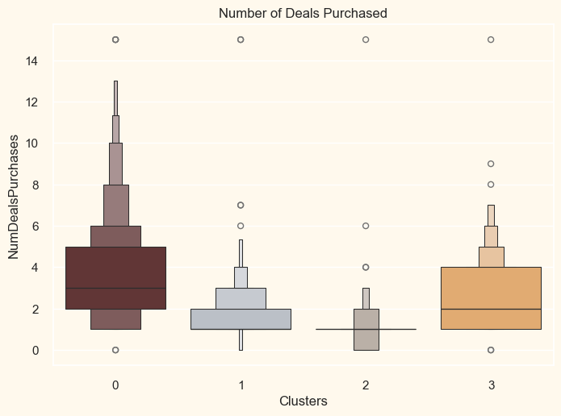

# Customer Segmentation For Effective Marketing Campaign

## Introduction

In this high-quality and much cherished project of mine, I will be performing an unsupervised clustering of data on customer records from a grocery store's database. Customer segmentation is the practice of separating customers into groups that reflect similarities in their characteristics and purchasing power in each cluster. I will divide customers into segments to optimize the significance of each customer to the business, modify products according to specific needs and behaviors, and help the business cater to the concerns of different types of customers. This also allows better management of repositories, launching successful campaigns, promos, and even targeted adverts for online products or services companies.

## Problem Statement

The current challenge faced by a client grocery store is the complexity and diversity of its customer base. With thousands of customers coming from various backgrounds—different family structures, marital statuses, ages, preferences, and income levels—understanding their purchasing behaviors through traditional data visualization methods becomes ineffective. This is because these methods often oversimplify the data or fail to capture the nuanced patterns that drive consumer decisions.

When new customers arrive, predicting their preferences becomes even more difficult. While human intuition may attempt to offer personalized suggestions based on past experience, it lacks the capacity to accurately analyze and anticipate the preferences of all customers. Human intuition is inherently limited by biases, individual experiences, and a finite ability to process large, diverse datasets. It also struggles to identify complex and hidden patterns in customer behavior that are crucial for effective segmentation and personalization.

Customer segmentation, which I will be using in this project, uses advanced algorithms to analyze vast amounts of data from customer interactions, purchases, and preferences. These techniques enable the identification of distinct customer groups with similar characteristics, allowing the grocery store to predict purchasing behaviors and preferences with a much higher degree of accuracy. As would be discovered in this project, customer segmentation will make room for tailored marketing, personalized offers, and better inventory management—methods that are much more effective than relying on human experience.

## Dataset Information

It's a real-life marketing campaign dataset I downloaded from Kaggle.com [here](https://www.kaggle.com/datasets/rodsaldanha/arketing-campaign). It has 29 columns and 2,240 rows. To make things simple, I designed the chart below to categorize them.

`You may also view the table containing the column data by clicking below`

  
Click to expand/collapse the table

  
  | Column Name           | Description                                                                 |
  |-----------------------|-----------------------------------------------------------------------------|
  | ID                    | Customer ID                                                                 |
  | Year_Birth            | Year Customer was Born                                                       |
  | Education             | Education Level                                                              |
  | Marital_Status        | Marital Status                                                               |
  | Income                | Income                                                                       |
  | Kidhome               | Do they have any Kids at home?                                               |
  | Teenhome              | Do they have any Teenager at home?                                           |
  | Dt_Customer           | When they became a customer                                                 |
  | Recency               | Recency of their purchase                                                   |
  | MntWines              | Amount spent on Wines                                                        |
  | MntFruits             | Amount spent on Fruits                                                       |
  | MntMeatProducts       | Amount spent on Meats                                                        |
  | MntFishProducts       | Amount spent on Fish Products                                                |
  | MntSweetProducts      | Amount spent on Sweets                                                       |
  | MntGoldProds          | Amount spent on Gold Products                                                |
  | NumDealsPurchases     | The number of purchases made by the customer through deals or promotions    |
  | NumWebPurchases       | The number of purchases made by the customer through the website            |
  | NumCatalogPurchases   | The number of purchases made by the customer through a catalog              |
  | NumStorePurchases     | The number of purchases made by the customer in a physical store            |
  | NumWebVisitsMonth     | The number of visits the customer made to the website per month             |
  | AcceptedCmp3          | Did the customer accept the 3rd campaign?                                    |
  | AcceptedCmp4          | Did the customer accept the 4th campaign?                                    |
  | AcceptedCmp5          | Did the customer accept the 5th campaign?                                    |
  | AcceptedCmp1          | Did the customer accept the 1st campaign?                                    |
  | AcceptedCmp2          | Did the customer accept the 2nd campaign?                                    |
  | Complain              | Did the customer make any complaints?                                        |
  | Z_CostContact         | Standardized values for the cost of contacting the customer                  |
  | Z_Revenue             | Standardized values for the revenue generated from the customer              |
  | Response              | Indicating *whether* or *not* the customer responded to a particular marketing campaign |
  

## Methodology

### Data Cleaning and Preparation for Algorithmic Processing:

- Unrecoverable missing records in the income column were deleted, making the dataset 2,216 rows from 2,240 rows.
- The `*Dt_Customer*` column was converted to datetime format.
- A new column or feature *`Customer_For`* was created to reflect the number of days between when a customer began to shop in the store and the last recorded date they did so.
- Feature engineering was performed on many other columns to get the Age of a customer, calculate the total spending of various items, reflect their marital status (because that matters too 😅), their family and children number, educational status, etc.
- Made the column names much easier to understand.
- Dropped detected outliers in `*Income*` and `*Age*` columns.
- Removed redundant features.
- Used PRINCIPAL COMPONENT ANALYSIS to reduce the dimensionality of the data. This is because of the several columns in it.

- The elbow method was used to determine the number of clusters that would be optimal for the dataset.
- The more dynamic (in my opinion) Agglomerative model was used for the clustering rather than a KMeans model. The clusters were plotted perfectly in the three-dimensional visual.

## Findings

### Income VS Spending According to Cluster

To check if I got an accurate representation of actual clusters in the dataset, I profiled the 4 clusters based on income and spending to see if there was any reasonable pattern. There was ✔️:

#### From above, we can see that Income vs Spending shows the following patterns:

- Cluster 1: `low` spending & `low` income  
- Cluster 3: `high` spending & `higher` income than low
- Cluster 0: `higher` spending & `higher` income than `higher`
- Cluster 2: `highest` spending & `highest` income

---

## Accepted Promos by Clusters

It is observable from the plot that there has not been an overwhelming response to campaigns 2, 3, 4, and 5 so far. Very few participants overall. Moreover, no one partook in all 5 of them, EXCEPT cluster 2. Also, cluster 1 partook the most in the first campaign. Perhaps better-targeted and well-planned campaigns are required to boost sales.

## Accepted Deals by Clusters

Unlike campaigns, the deals offered did well. It had the best outcome with cluster 0 and cluster 3. However, our star customers (cluster 1) are not much into the deals. Nothing seems to attract cluster 2 overwhelmingly.

## Profiling: Making Sense Out of the Clusters

Now, all this cluster information is good and all, but unless I find out the kind of people in those clusters, my stakeholders' minds will be clustered up 😅 with confusion as it already might be by now.

All the technical things are in the Jupyter notebook. So for simplicity's sake, below are the findings from the Profiling of the Clusters:

# About Cluster Number 0

- A family with only one or no kid, and/or one teenager, making a maximum of 2 children and minimum of zero, and having a family size from 2 to 4.
- They consist of customers from the minimum to the maximum date.
- Are between the age range of 31 - 78 years.
- Spending between `$250 and $2000`.
- Is definitely a parent.

# About Cluster Number 1

- These customers are in a family of a maximum of 1 kid, spending below $500.
- Some have a teenager, but a maximum of 1. Those with a teenager spend much less than those without one.
- They are low spenders and have been customers from the onset too.
- They span across all ages from age 20 - 80.
- Most of them have a child, many have none, and few have 2.
- Family sizes of these customers are mostly in 2s and 3s with a few 1s.
- Most are parents, few are not.
- Some are alone (in marital status) others are not.

# About Cluster Number 2

- They are the high spenders, having no children.
- They are not parents and have no more than 2 in the family.
- They have been customers from the onset.
- They are between mid-twenties and late 70s.

# About Cluster Number 3

- They all have children at home, most of them have a kid, less of them have none, and the fewest of them have 2. Those with none spend less.
- More than 90% of them have a teenager, the rest having either none or 2, have lesser purchases.
- Family sizes from 2 to 5, 3 and 4 being the most.
- They have also been customers from the onset.
- Their age range is from their mid-30s to late-70s.

# Conclusion

As is observable from the findings, these details about customer segment purchasing and promo response behaviour would be undiscoverable with mere visualizations. With the insight provided, the stakeholder will be able to understand what each customer wants, and predict future customer purchasing behaviour alongside the kind of promos to market to them that will guarantee near 100% success! 

### Thank you very much for your time, and kindly remember to view the Jupyter Notebook for a more technical understanding of how I arrived at my findings. 

