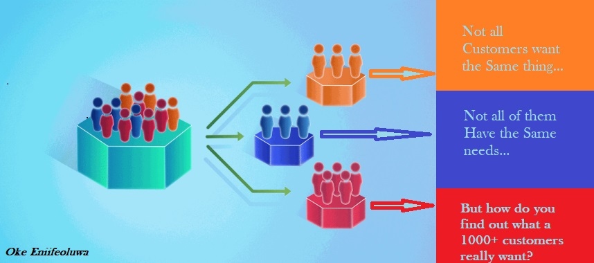

# Customer Segmentation Project

## Introduction

In this project, I will be performing an unsupervised clustering of data on the customer's records from a grocery store's database. Customer segmentation is the practice of separating customers into groups that reflect similarities among customers in each cluster. I will divide customers into segments to optimize the significance of each customer to the business. To modify products according to specific needs and behaviours of the customers. It also helps the business to cater to the concerns of different types of customers, launch successful campaigns, promos and even targeted adverts for online products or services companies.

## Problem Statement

The current challenge faced by a client grocery store is the complexity and diversity of its customer base. With thousands of customers coming from various backgrounds—different family structures, marital statuses, ages, preferences, and income levels—understanding their purchasing behaviors through traditional data visualization methods becomes ineffective. This is because these methods often oversimplify the data or fail to capture the nuanced patterns that drive consumer decisions.

When new customers arrive, predicting their preferences becomes even more difficult. While human intuition may attempt to offer personalized suggestions based on past experience, it lacks the capacity to accurately analyze and anticipate the preferences of all customers. Human intuition is inherently limited by biases, individual experiences, and a finite ability to process large, diverse datasets. It also struggles to identify complex and hidden patterns in customer behavior that are crucial for effective segmentation and personalization.

Customer segmentation, which I will be using in this project, uses advanced algorithms to analyze vast amounts of data from customer interactions, purchases, and preferences. These techniques enable the identification of distinct customer groups with similar characteristics, allowing the grocery store to predict purchasing behaviors and preferences with a much higher degree of accuracy. As would be discovered in this project, customer segmentation will make room for tailored marketing, personalized offers, and better inventory management—methods that are much more effective than relying on human experience.

## Dataset Information

It's marketing campaign dataset I downloaded from Kaggle.com [here](https://www.kaggle.com/datasets/rodsaldanha/arketing-campaign). It has 29 columns and 2,240 rows. To make things simple, I designed the chart below to categorize them.

`You May also view the table containing the column data by clicking below`

  
Click to expand/collapse the table

  
  | Column Name           | Description                                                                 |
  |-----------------------|-----------------------------------------------------------------------------|
  | ID                    | Customer ID                                                                 |
  | Year_Birth            | Year Customer was Born                                                       |
  | Education             | Education Level                                                              |
  | Marital_Status        | Marital Status                                                               |
  | Income                | Income                                                                       |
  | Kidhome               | Do they have any Kids at home?                                               |
  | Teenhome              | Do they have any Teenager at home?                                           |
  | Dt_Customer           | When they became a customer                                                 |
  | Recency               | Recency of their purchase                                                   |
  | MntWines              | Amount spent on Wines                                                        |
  | MntFruits             | Amount spent on Fruits                                                       |
  | MntMeatProducts       | Amount spent on Meats                                                        |
  | MntFishProducts       | Amount spent on Fish Products                                                |
  | MntSweetProducts      | Amount spent on Sweets                                                       |
  | MntGoldProds          | Amount spent on Gold Products                                                |
  | NumDealsPurchases     | The number of purchases made by the customer through deals or promotions    |
  | NumWebPurchases       | The number of purchases made by the customer through the website            |
  | NumCatalogPurchases   | The number of purchases made by the customer through a catalog              |
  | NumStorePurchases     | The number of purchases made by the customer in a physical store            |
  | NumWebVisitsMonth     | The number of visits the customer made to the website per month             |
  | AcceptedCmp3          | Did the customer accept the 3rd campaign?                                    |
  | AcceptedCmp4          | Did the customer accept the 4th campaign?                                    |
  | AcceptedCmp5          | Did the customer accept the 5th campaign?                                    |
  | AcceptedCmp1          | Did the customer accept the 1st campaign?                                    |
  | AcceptedCmp2          | Did the customer accept the 2nd campaign?                                    |
  | Complain              | Did the customer make any complaints?                                        |
  | Z_CostContact         | Standardized values for the cost of contacting the customer                  |
  | Z_Revenue             | Standardized values for the revenue generated from the customer              |
  | Response              | Indicating *whether* or *not* the customer responded to a particular marketing campaign |
  

